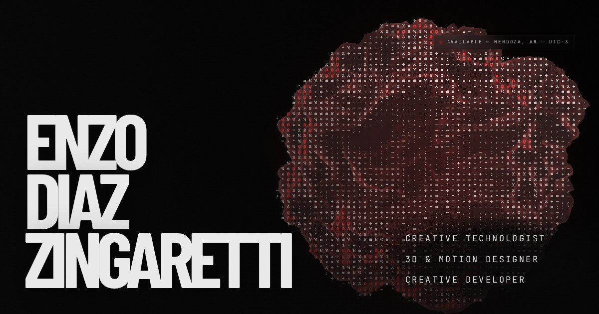

# Enzo Diaz Zingaretti — Portfolio



Portfolio of a creative technologist: 3D and motion work, real-time generative pieces, and the web that shows them. React + Three.js, deployed on Vercel, in Spanish, English and Portuguese.

**Live:** [portfolio-kexxy.vercel.app](https://portfolio-kexxy.vercel.app)

<!-- Pendiente: un GIF de 8 s del hero acá arriba se ve mejor que la captura. -->

## What to look at

| If you care about… | Start here |
|---|---|
| **Real-time graphics** | [`src/components/AsciiPass.js`](src/components/AsciiPass.js): a hand-written post-processing pass that rewrites the Three.js hero as a grid of characters, with per-scene black and white points measured from the render target. [`HeroThreeBackground.jsx`](src/components/HeroThreeBackground.jsx): a 16,000-particle swarm moved entirely in the vertex shader, and the pointer projected through the real camera. |
| **Generative systems** | [`src/lab/pieces/`](src/lab/pieces): eight canvas pieces, each a different algorithm family (Gray-Scott reaction-diffusion, De Jong attractor, Chladni figures, Verlet cloth, harmonograph…), with live parameters and seeded randomness: same seed, same artwork. |
| **Product engineering** | [`api/`](api): a git-backed admin. Serverless functions commit content to this repository through the GitHub API and Vercel redeploys. scrypt password hash, HMAC-signed session cookies, a write allowlist. No database. |
| **Performance** | three.js loads only once the home page is visited; the preloader runs once per session; grid covers are 8-second, ~600 KB cuts instead of the full videos; images are capped at 1600 px; hashed assets are cached as immutable. |
| **Testing** | [`tests/`](tests): content integrity across the three languages, the admin's auth and path checks, category building. CI runs lint, tests and a production build on every push. |

## Stack

React 19 · Vite 6 · React Router 7 · Tailwind CSS 3 · Three.js · Lenis · Vercel Functions (Node) · Vitest

## Architecture notes

- **Four routes, one per discipline** (`/motion`, `/3d`, `/grafica`, `/web`) inside a persistent shell. The WebGL background lives in the shell, so moving between routes pauses and dims it instead of recreating the context.
- **Content has two sources.** [`src/siteContent.i18n.js`](src/siteContent.i18n.js) holds every string in the three languages. [`public/content.json`](public/content.json) is what the admin edits, and it overrides the Spanish copy at runtime. [`tests/content.test.js`](tests/content.test.js) fails if the two drift apart, or if a piece points at a file that is not in `public/`.
- **The initial language comes from the browser**, falling back to English.
- **Overlays and smooth scroll:** Lenis cancels wheel and touch events while an overlay is open, so every scrollable container inside one carries `data-lenis-prevent`.

## Running locally

```bash
npm install
npm run dev      # http://localhost:5173
npm test         # vitest
npm run build
```

Admin setup (environment variables, password hash): [`ADMIN_SETUP.md`](ADMIN_SETUP.md).

`CLAUDE.md` is the engineering log used in AI-assisted sessions, in Spanish: decisions, measurements and traps that were already solved.

---

<details>
<summary><b>Español</b></summary>

<br>

Portfolio de un creative technologist: piezas 3D y motion, obra generativa en tiempo real y la web que las muestra. React + Three.js, en Vercel, en español, inglés y portugués.

**Qué mirar:**

- **Gráficos en tiempo real:** `src/components/AsciiPass.js`, un post-proceso escrito a mano que reescribe el hero de Three.js como grilla de caracteres, y `HeroThreeBackground.jsx`, con un enjambre de 16.000 partículas movido entero en el vertex shader.
- **Sistemas generativos:** `src/lab/pieces/`, ocho piezas en canvas, cada una de una familia de algoritmo distinta, con parámetros en vivo y azar con semilla.
- **Producto:** `api/`, un panel de administración sobre git: las funciones serverless commitean el contenido en este repo por la API de GitHub. Hash scrypt, cookies de sesión firmadas con HMAC, lista blanca de escritura, sin base de datos.
- **Tests:** `tests/`, integridad del contenido en los tres idiomas, la autenticación del panel y la construcción de categorías. El CI corre lint, tests y build en cada push.

**Contenido:** los textos viven en `src/siteContent.i18n.js` (tres idiomas) y `public/content.json`, que edita el panel y pisa el español. Un test falla si se desincronizan.

```bash
npm install && npm run dev
```

</details>
